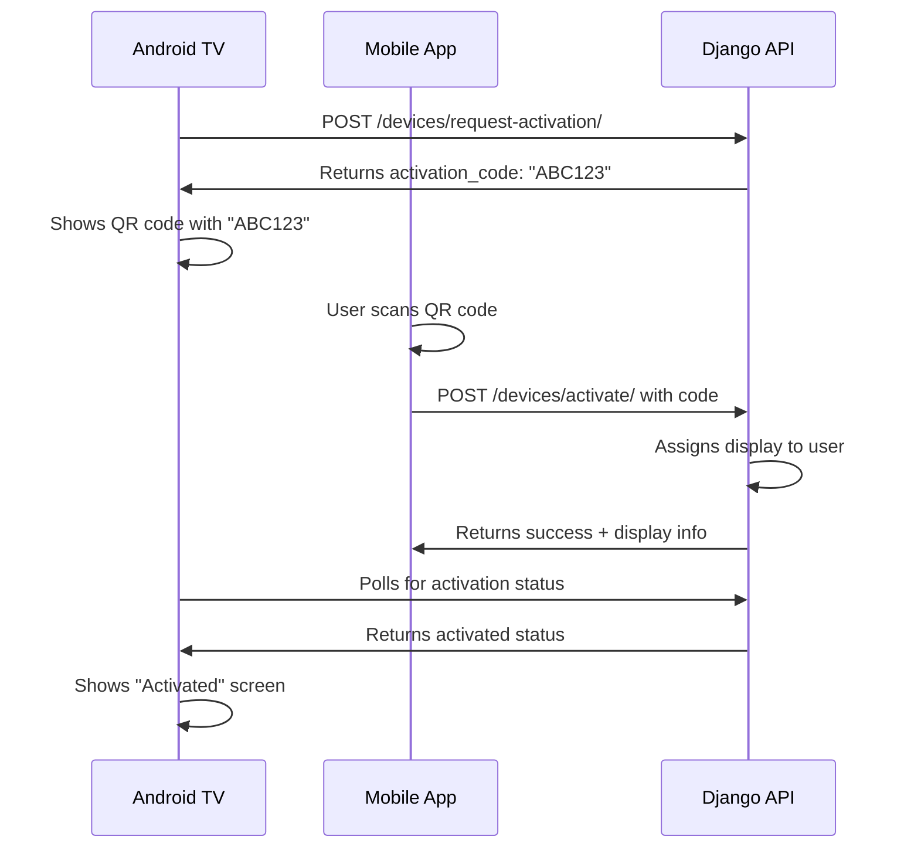

# DisplayAds Mobile Manager

A comprehensive React Native mobile application for managing DisplayAds digital signage system. This app complements the web dashboard by providing mobile-specific functionality, especially QR code scanning for TV display activation.

## 🎯 Features

### Core Functionality (Mirrors Web Dashboard)
- **User Authentication** - Login/Register with JWT token management
- **Dashboard Overview** - Statistics and quick actions
- **Campaign Management** - Create, edit, delete campaigns
- **Media Library** - Upload, manage, and preview media files
- **Display Management** - Monitor and control digital displays
- **Analytics** - Device status and campaign performance

### Mobile-Specific Features
- **📱 QR Code Scanning** - Activate TV displays by scanning QR codes
- **📸 Camera Integration** - Direct media upload from camera
- **🔔 Push Notifications** - Real-time alerts for display status
- **📱 Touch-Optimized UI** - Native mobile interface
- **🌐 Offline Support** - Basic functionality when offline

## 🏗️ Architecture

### Project Structure
```
DisplayAdsManager/
├── App.tsx                     # Main app component with navigation
├── src/
│   ├── contexts/
│   │   ├── AuthContext.tsx     # Authentication state management
│   │   └── ApiContext.tsx      # API service provider
│   ├── services/
│   │   └── ApiService.ts       # Django backend communication
│   ├── screens/
│   │   ├── LoginScreen.tsx     # User authentication
│   │   ├── RegisterScreen.tsx  # Account creation
│   │   ├── DashboardScreen.tsx # Main overview
│   │   ├── QRScannerScreen.tsx # QR code scanning (key feature)
│   │   ├── CampaignsScreen.tsx # Campaign management
│   │   ├── MediaLibraryScreen.tsx # Media management
│   │   ├── DisplaysScreen.tsx  # Display monitoring
│   │   └── ProfileScreen.tsx   # User profile
│   ├── components/
│   │   ├── CampaignCard.tsx    # Campaign display component
│   │   ├── MediaCard.tsx       # Media file component
│   │   └── DisplayCard.tsx     # Display status component
│   └── utils/
│       ├── permissions.ts      # Camera & storage permissions
│       └── storage.ts          # Local data persistence
└── package.json
```

### Navigation Structure
```
Stack Navigator
├── Login Screen
├── Register Screen
└── Main Tab Navigator
    ├── Dashboard Tab
    ├── QR Scanner Tab (Key Mobile Feature)
    ├── Campaigns Tab
    ├── Media Tab
    └── Displays Tab
```

## 📱 Key Mobile Features

### 1. QR Code Scanner
**Purpose**: Activate TV displays remotely
- Scans activation codes from TV screens
- Camera permission handling
- Manual code entry fallback
- Real-time activation with backend

**User Flow**:
1. User opens QR Scanner tab
2. Points camera at TV showing activation code
3. App scans 6-character alphanumeric code
4. User enters display name and location
5. App calls `/api/v1/devices/activate/` endpoint
6. Display is activated and assigned to user account

### 2. Mobile-Optimized Dashboard
- Touch-friendly statistics cards
- Quick action buttons for common tasks
- Pull-to-refresh functionality
- Native mobile navigation

### 3. Camera Integration
- QR code scanning for display activation
- Direct photo upload for media library
- Permission management for camera access
- Image compression and optimization

## 🔌 Backend Integration

### API Endpoints Used
```typescript
// Authentication
POST /api/v1/login/
POST /api/v1/register/
POST /api/v1/logout/
POST /api/v1/token/refresh/

// Dashboard Data
GET /api/v1/campaigns/
GET /api/v1/media/
GET /api/v1/displays/

// QR Code Activation (Key Feature)
POST /api/v1/devices/activate/
{
  "activation_code": "ABC123",
  "display_name": "Lobby TV",
  "location": "Main Lobby"
}

// Media Management  
POST /api/v1/media/ (multipart/form-data)
DELETE /api/v1/media/{id}/

// Campaign Management
POST /api/v1/campaigns/
PATCH /api/v1/campaigns/{id}/
DELETE /api/v1/campaigns/{id}/

// Display Management
GET /api/v1/displays/
PATCH /api/v1/displays/{id}/
```

### Authentication Flow
1. User logs in with email/password
2. App receives JWT access & refresh tokens
3. Tokens stored in AsyncStorage
4. API requests include Bearer token
5. Automatic token refresh on 401 errors
6. Logout clears all stored tokens

## 📦 Dependencies

### Core React Native
- `react`: ^18.2.0
- `react-native`: ^0.73.6
- `@react-navigation/native`: Navigation system
- `@react-navigation/stack`: Stack navigation
- `@react-navigation/bottom-tabs`: Tab navigation

### Mobile-Specific Features
- `react-native-camera`: QR code scanning
- `react-native-qrcode-scanner`: QR code utilities
- `react-native-permissions`: Camera permissions
- `react-native-image-picker`: Photo selection
- `react-native-document-picker`: File selection

### Backend Communication
- `axios`: HTTP requests
- `@react-native-async-storage/async-storage`: Token storage

### UI Components
- `react-native-vector-icons`: Icons
- `react-native-gesture-handler`: Touch gestures
- `react-native-screens`: Native screen components

## 🚀 Setup Instructions

### 1. Install Dependencies
```bash
cd DisplayAdsManager
npm install

# iOS specific
cd ios && pod install
```

### 2. Configure Backend URL
Update `src/services/ApiService.ts`:
```typescript
const BASE_URL = 'http://YOUR_BACKEND_IP:8000/api/v1/';
```

### 3. Configure Permissions
**Android** (`android/app/src/main/AndroidManifest.xml`):
```xml
<uses-permission android:name="android.permission.CAMERA" />
<uses-permission android:name="android.permission.WRITE_EXTERNAL_STORAGE" />
```

**iOS** (`ios/DisplayAdsManager/Info.plist`):
```xml
<key>NSCameraUsageDescription</key>
<string>This app needs camera access to scan QR codes from TV displays</string>
```

### 4. Run the App
```bash
# Android
npm run android

# iOS  
npm run ios
```

## 🔄 Mobile-Web Feature Parity

| Feature | Web Dashboard | Mobile App | Notes |
|---------|--------------|------------|-------|
| User Authentication | ✅ | ✅ | JWT tokens |
| Dashboard Overview | ✅ | ✅ | Statistics cards |
| Campaign Management | ✅ | ✅ | Full CRUD |
| Media Library | ✅ | ✅ | + Camera upload |
| Display Management | ✅ | ✅ | + QR activation |
| Analytics | ✅ | ✅ | Device status |
| QR Code Scanning | ❌ | ✅ | **Mobile-only** |
| Bulk Operations | ✅ | ⚠️ | Limited on mobile |
| Advanced Scheduling | ✅ | ⚠️ | Basic mobile UI |

## 📱 Mobile-Specific Enhancements

### User Experience
- **Native Navigation**: Bottom tabs + stack navigation
- **Touch Gestures**: Swipe, pull-to-refresh
- **Responsive Design**: Works on phones and tablets
- **Offline Indicators**: Shows connection status
- **Loading States**: Smooth transitions and feedback

### Performance
- **Image Optimization**: Automatic compression
- **Lazy Loading**: Media thumbnails loaded on demand
- **Token Management**: Automatic refresh handling
- **Error Recovery**: Retry failed network requests

### Security
- **Biometric Auth**: Optional fingerprint/face unlock
- **Secure Storage**: Encrypted token storage
- **Certificate Pinning**: API communication security
- **Permission Management**: Camera, storage access

## 🎯 Use Cases

### Primary Use Case: TV Display Activation
1. **Business Owner Setup**:
   - Installs TV app on Android TV
   - TV displays activation code (e.g., "ABC123")
   - Uses mobile app to scan QR code
   - Names display and assigns location
   - Display is activated and ready for campaigns

2. **Campaign Management**:
   - Creates campaigns on mobile or web
   - Uploads media via mobile camera
   - Assigns campaigns to displays
   - Monitors performance via analytics

3. **Multi-Location Management**:
   - Business with multiple locations
   - Uses mobile app for on-site activation
   - Manages all displays from single account
   - Real-time status monitoring

## 🔧 Development Notes

### Backend Considerations
The mobile app requires these CORS settings in Django:

```python
CORS_ALLOWED_ORIGINS = [
    "http://localhost:3000",
    "http://localhost:5173",
    # Add mobile app origins if using IP addresses
]
```

### Device Activation Flow


## 🚀 Future Enhancements

### Planned Features
- **Push Notifications**: Display alerts, campaign status
- **Geofencing**: Location-based display management
- **Voice Commands**: "Activate display" voice control
- **Augmented Reality**: Point camera to see display info overlay
- **Team Collaboration**: Multi-user account management
- **Advanced Analytics**: Mobile-optimized charts and graphs

### Technical Improvements
- **Offline Mode**: Cache critical data for offline access
- **Background Sync**: Sync data when app becomes active
- **Performance Monitoring**: Crash reporting and analytics
- **A/B Testing**: Feature flag system for UI experiments

## 📋 Summary

This React Native mobile app provides a complete mobile companion to the DisplayAds web dashboard, with the key innovation being **QR code scanning for TV display activation**. This solves the practical problem of remotely activating and managing digital signage displays without needing to physically interact with each TV.

The app maintains full feature parity with the web dashboard while adding mobile-specific enhancements like camera integration, touch-optimized UI, and native mobile navigation patterns.

**Key Value Proposition**: Transform any smartphone into a powerful digital signage management tool with the unique ability to activate TV displays by simply scanning a QR code.
