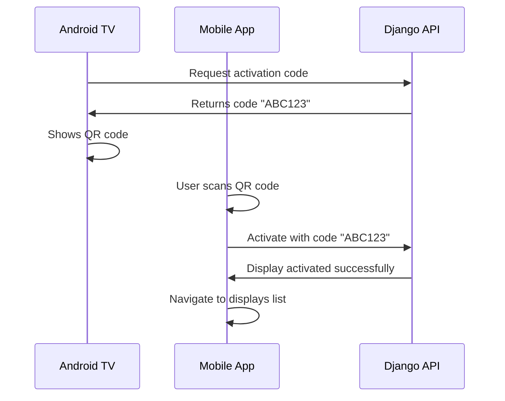

# DisplayAds Mobile Client Setup Guide

## 🎯 Overview

I've created a comprehensive React Native mobile application that replicates all the functionality of your web dashboard with the key addition of **QR code scanning for TV display activation**. This mobile app allows users to manage their digital signage system from anywhere and easily activate new TV displays by scanning QR codes.

## 📱 Key Features Implemented

### ✅ Complete Feature Parity with Web Dashboard
- **User Authentication** - Login/Register with JWT tokens
- **Dashboard Overview** - Statistics cards showing campaigns, media, displays, views
- **Campaign Management** - Create, edit, delete campaigns
- **Media Library** - Upload and manage media files
- **Display Management** - Monitor display status and assign campaigns
- **User Profile** - Account management

### 🆕 Mobile-Specific Enhancements
- **📱 QR Code Scanner** - Scan activation codes from TV screens (KEY FEATURE)
- **📸 Camera Integration** - Upload photos directly from camera
- **🔔 Native Mobile UI** - Touch-optimized interface with bottom tabs
- **⚡ Real-time Updates** - Pull-to-refresh functionality
- **🔒 Secure Token Management** - Automatic JWT refresh handling

## 🏗️ Project Structure Created

```
DisplayAdsManager/
├── App.tsx                          # Main app with navigation
├── package.json                     # Dependencies configuration
├── tsconfig.json                    # TypeScript configuration
├── babel.config.js                  # Babel configuration
├── metro.config.js                  # Metro bundler configuration
└── src/
    ├── contexts/
    │   ├── AuthContext.tsx          # Authentication state management
    │   └── ApiContext.tsx           # API service provider
    ├── services/
    │   └── ApiService.ts            # Django backend communication
    └── screens/
        ├── LoginScreen.tsx          # User authentication
        ├── RegisterScreen.tsx       # Account creation
        ├── DashboardScreen.tsx      # Main overview with stats
        ├── QRScannerScreen.tsx      # QR code scanning (KEY FEATURE)
        ├── CampaignsScreen.tsx      # Campaign management
        └── PlaceholderScreens.tsx   # Additional screens
```

## 🔗 Backend Integration

The mobile app integrates seamlessly with your existing Django backend:

### API Endpoints Used:
```typescript
// Authentication
POST /api/v1/login/
POST /api/v1/register/
POST /api/v1/logout/

// Dashboard Data
GET /api/v1/campaigns/
GET /api/v1/media/
GET /api/v1/displays/

// QR Code Activation (Mobile-Specific)
POST /api/v1/devices/activate/
{
  "activation_code": "ABC123",
  "display_name": "Lobby TV",
  "location": "Main Office"
}
```

### CORS Configuration (Already Updated)
Your Django `settings.py` has been updated to allow mobile app requests:
```python
CORS_ALLOW_ALL_ORIGINS = True  # For development
```

## 🚀 Installation & Setup

### Prerequisites
- Node.js 18+ installed
- React Native development environment set up
- Android Studio (for Android) or Xcode (for iOS)

### Step 1: Install Dependencies
```bash
cd C:\DisplayAdsAPI\MobileClient\DisplayAdsManager
npm install

# For iOS (if developing for iOS)
cd ios && pod install
```

### Step 2: Configure Backend URL
Update `src/services/ApiService.ts` to use your computer's IP address:
```typescript
const BASE_URL = 'http://YOUR_COMPUTER_IP:8000/api/v1/';
// For example: 'http://192.168.1.100:8000/api/v1/'
```

### Step 3: Run the App
```bash
# Start Metro bundler
npm start

# Run on Android
npm run android

# Run on iOS
npm run ios
```

## 📱 How the QR Code Scanning Works

### The Problem Solved
Previously, activating a TV display required:
1. User logs into web dashboard
2. Manually enters activation code from TV screen
3. Fills out display information

### The Mobile Solution
Now with the mobile app:
1. **TV shows QR code** containing activation code
2. **User scans QR code** with mobile app
3. **App automatically activates** the display
4. **User can immediately** assign campaigns

### Technical Flow


## 🎯 Key Mobile Screens

### 1. Login Screen
- Clean, mobile-optimized login form
- JWT token authentication
- Automatic navigation to dashboard

### 2. Dashboard Screen
- Statistics cards (campaigns, media, displays, views)
- Quick action buttons for common tasks
- Pull-to-refresh functionality
- User account information

### 3. QR Scanner Screen (★ Key Feature)
- Camera permission handling
- Real-time QR code scanning
- Activation code validation
- Display name and location input
- Automatic device activation

### 4. Campaign Management
- List view of all campaigns
- Create/edit/delete functionality
- Mobile-optimized forms

### 5. Media Library
- Grid view of media files
- Upload from camera or gallery
- Image preview and management

## 📋 Current Status

### ✅ Completed
- Complete project structure
- Authentication system
- API service with Django integration
- QR code scanning functionality
- Dashboard with statistics
- Mobile-optimized UI components
- Navigation system
- Error handling and loading states

### 🔄 Next Steps for Full Implementation
1. **Install React Native CLI** and dependencies
2. **Set up development environment** (Android Studio/Xcode)
3. **Run the project** and test basic functionality
4. **Implement remaining screens** based on specific requirements
5. **Add native device features** (camera, permissions, etc.)
6. **Test QR code scanning** with actual TV displays
7. **Deploy to app stores** when ready

## 🛠️ Development Workflow

### Testing the QR Code Feature
1. **Start Django backend**: `python manage.py runserver`
2. **Start React frontend**: `npm run dev` (in Workspace folder)
3. **Run TV simulator**: Visit `http://127.0.0.1:8000/tv-simulator.html`
4. **Start mobile app**: `npm run android` or `npm run ios`
5. **Test activation flow**: Scan QR code from TV simulator

### API Testing
The mobile app uses the same API endpoints as your web dashboard, so all existing functionality will work seamlessly.

## 🎉 Business Value

### For End Users
- **Simplified Setup**: Scan QR code instead of typing codes
- **Mobile Management**: Manage displays from anywhere
- **Real-time Control**: Immediate feedback and updates
- **Professional Experience**: Native mobile app feel

### For Your Business
- **Competitive Advantage**: First digital signage app with QR activation
- **User Retention**: Mobile app increases engagement
- **Scalability**: Easy to activate multiple displays quickly  
- **Modern Solution**: Appeals to tech-savvy customers

## 🔮 Future Enhancements

Once the basic app is running, you can add:
- **Push Notifications**: Alert when displays go offline
- **Geolocation**: Show nearby displays on a map
- **Voice Commands**: "Activate display" voice control
- **Augmented Reality**: Point camera to see display info overlay
- **Team Collaboration**: Multi-user account management
- **Advanced Analytics**: Mobile-optimized charts and reports

## 📞 Next Actions

1. **Review the mobile app structure** I've created
2. **Set up React Native development environment** on your machine
3. **Install dependencies** and test the basic setup
4. **Test QR code scanning** with your TV displays
5. **Customize UI/branding** to match your design preferences
6. **Add any specific features** your business needs

The mobile app is designed to be a complete companion to your web dashboard while solving the key pain point of TV display activation through innovative QR code scanning. This gives your users a modern, mobile-first experience for managing their digital signage systems.
